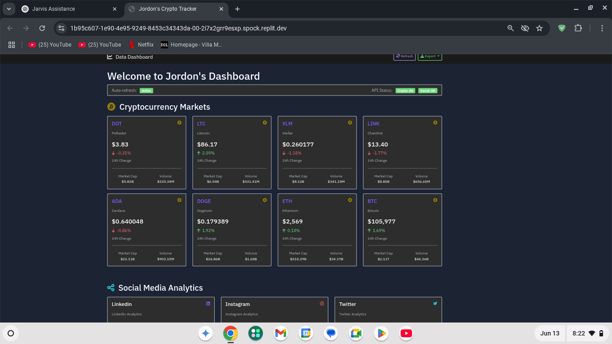

## 📊 Crypto Dashboard Preview

A real-time cryptocurrency dashboard using the CoinGecko API.

### Features
- Live crypto prices (BTC, ETH, ADA, DOT, LINK, LTC, XLM, DOGE)
- 24-hour price change, volume, market cap
- Auto-refresh every 30 seconds
- Clean Bootstrap dark theme UI
- CSV export ready (optional feature)

### Built With
- Python
- Flask
- CoinGecko API
- HTML/CSS/JS (Bootstrap)

### Status
✔️ UI fully working  
✔️ API connected  
⏳ CSV export in progress

---

### Demo Preview

---

### Author
**Jordon** — Student dev focused on building projects that generate income and impact.
